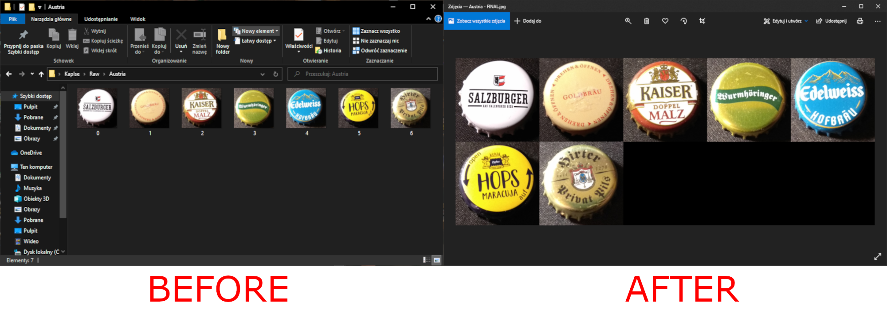

<h1>Idea</h1>
I like beer, but I also like to collect things. My idea was to combine these two activities.
 I made a program which organises bottle cap pictures into one big photo for easier review and showcasing for my friends.
 A program is using OpenCV and Boost libraries.

<h1>Setup</h1> 
The user has to insert two paths on the program start, the first path to the source folder, and the second path for processed files.
If the first path includes only directories, the program will open all directories looking for files to process.

<h1>Processing</h1> 
At this stage, the program has one catalog with files.
This program can handle JPG and PNG files. Files with any different file format will be skipped.
 For the best final result, images should be resized to 1000x1000px. If the size of the image is different, it will be resized by force. The final image size is determined by the number of files in the directory.

The program will count time during file processing. Together with the final image, a summary report will be generated. If an error occurs, the user will be informed in the console, and the special log file will be also generated.
